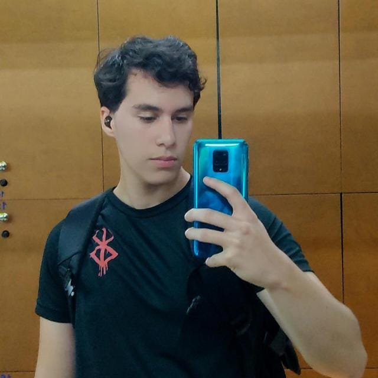

# Projeto Sanum

Este projeto foi desenvolvido como parte da disciplina de **Requisitos de Software** do curso de Engenharia de Software, semestre **2025/2**, **Turma 1**, ministrada pelo docente George Marsciano Correa.

## Introdução

## Objetivo Geral

## Objetivos Específicos

## Integrantes do grupo

  <!-- Pessoa 1 -->
<a href="https://github.com/GiovanniMateus" style="text-decoration: none; color: inherit;">
  

    
    <h3>Giovanni</h3>
    
Líder do grupo e Desenvolvedor

  

</a>

<a href="https://github.com/Pabloo8" style="text-decoration: none; color: inherit;">
  

    
    <h3>Pablo Cunha</h3>
    
Desenvolvedor 

  

</a>

<a href="https://github.com/alvesIngrid" style="text-decoration: none; color: inherit;">
  

    
    <h3>Ingrid Alves</h3>
    
Desenvolvedor

  

</a>

---

## Histórico de Versão

| Data     | Versão | Descrição             | Autor              |
| -------- | ------ | --------------------- | ------------------ |
| 12/09/25 | 1.0    | Criação do Documento  | Pablo de Jesus     |
