# Requisitos de Software - PBB

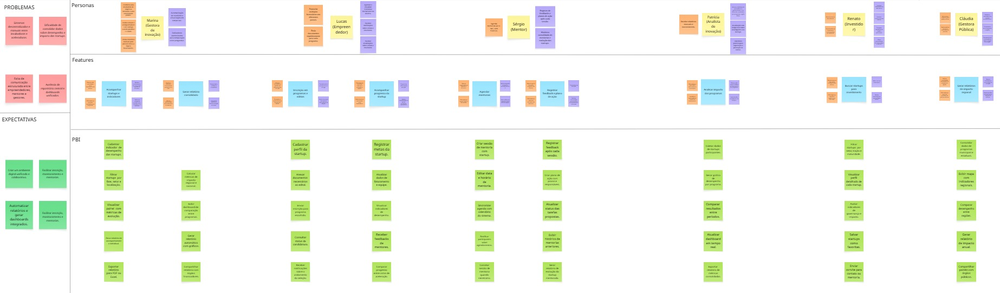

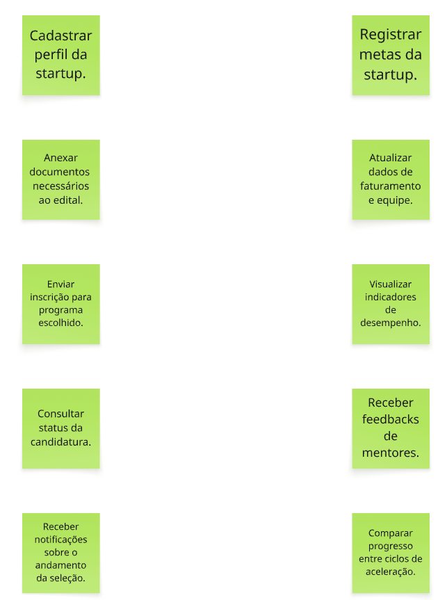
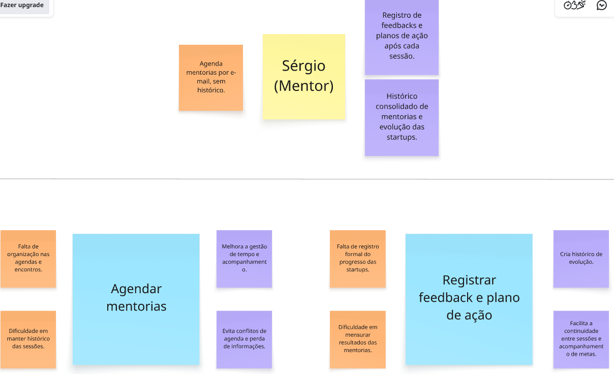

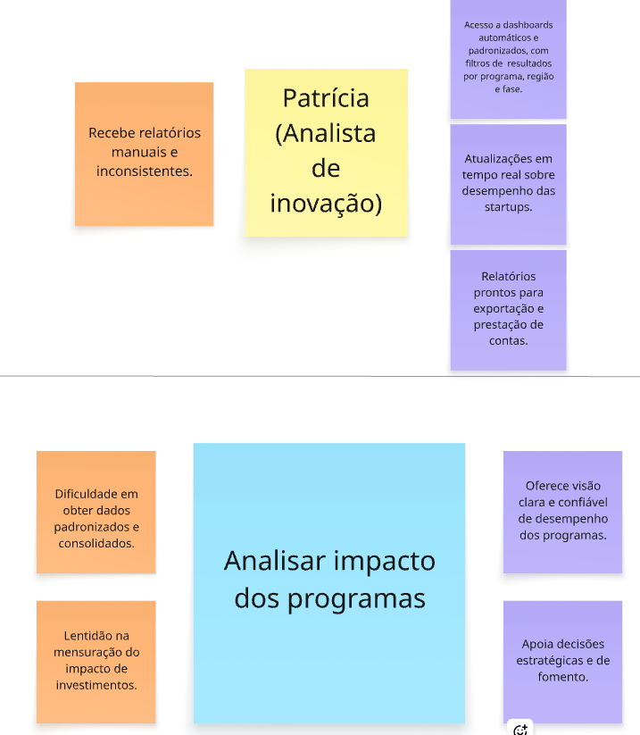

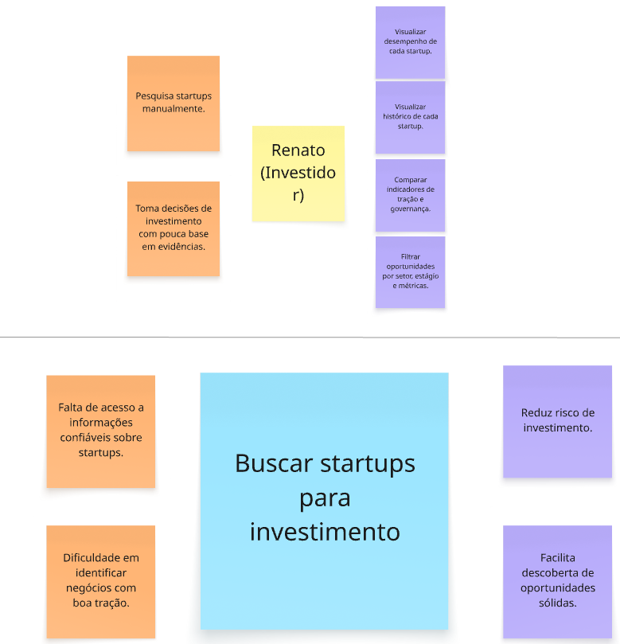

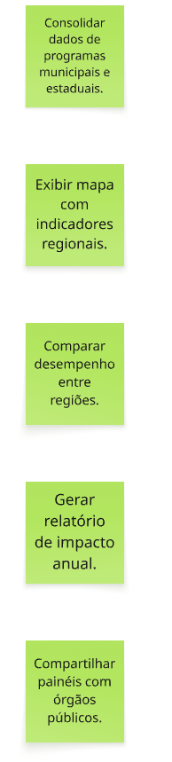

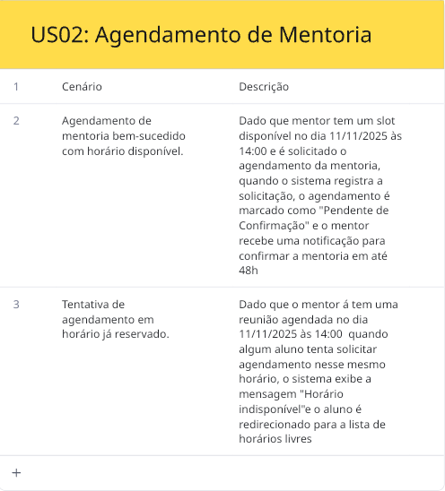
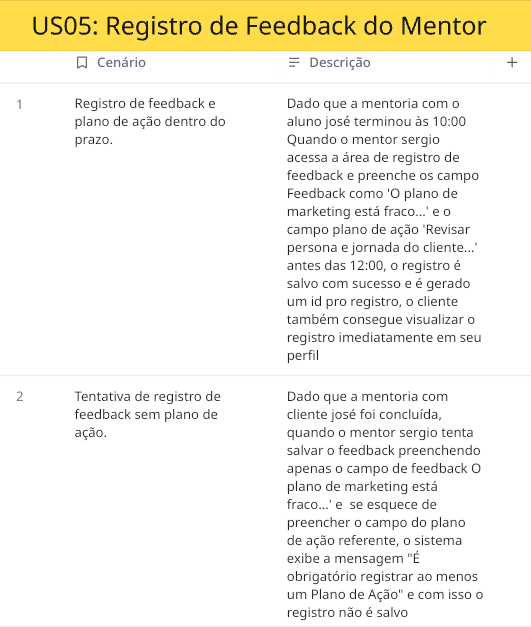
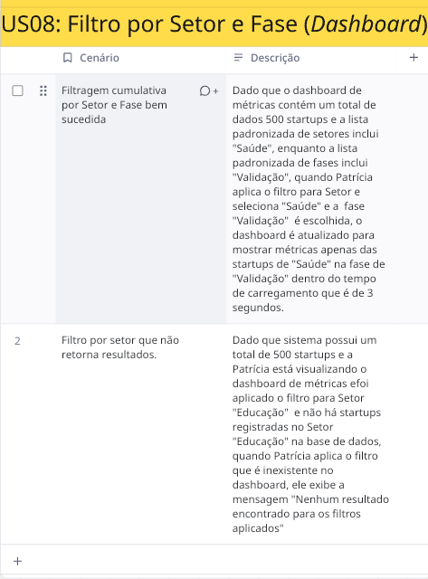
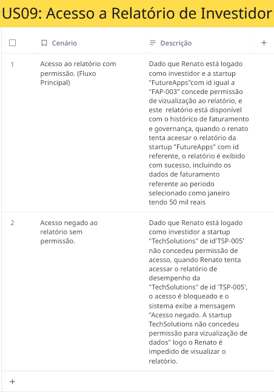

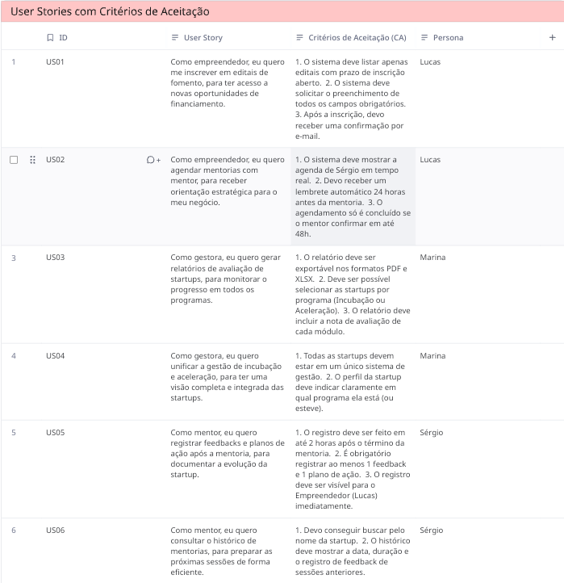

# 🚀 Documentação do Projeto: InovaHub

---

## 1. Problemas e Expectativas 

| 🛑 PROBLEMAS (Dores) | 🚀 EXPECTATIVAS (Objetivos) |
| :--- | :--- |
| Sistemas descentralizados e manuais entre incubadoras e aceleradoras. | Criar um ambiente digital unificado e colaborativo. |
| Dificuldade de consolidar dados sobre desempenho e impacto das startups. | Facilitar inscrição, monitoramento e mentorias. |
| Falta de comunicação estruturada entre empreendedores, mentores e gestores. | Automatizar relatórios e gerar dashboards integrados. |
| Ausência de repositório central e dashboards unificados. | Facilitar inscrição, monitoramento e mentorias. |

---

## 2. Personas 

---

### 👤 Persona: Marina (Gestora de inovação)

**🟧 Atividades vs 🟪 Necessidades**

| 🟧 O que faz (Atual) | 🟪 O que precisa (Futuro) |
| :--- | :--- |
| Coordena uma incubadora de empresas vinculada a uma universidade pública. | Automatização de relatórios e visualização em tempo real. |
| Realiza seleção e acompanhamento de startups usando planilhas e e-mails. | Indicadores padronizados para comparação entre programas. |
| Produz relatórios manuais para prestar contas a órgãos financiadores. | |

**🧩 Features e PBIs da Marina**

| Feature | 🟧 Problema (Dor) | 🟪 Benefício (Ganho) | 📋 PBIs (User Stories) |
| :--- | :--- | :--- | :--- |
| **Acompanhar startups e indicadores** | Falta de visão consolidada sobre desempenho das startups. Dificuldade em comparar resultados entre programas. | Facilita o monitoramento em tempo real e a gestão de resultados. Melhora a tomada de decisão e reduz retrabalho com planilhas. | • Cadastrar indicador de desempenho das startups. • Filtrar startups por fase, setor e localização. • Visualizar painel com métricas de evolução. • Gerar relatório de acompanhamento individual. • Exportar relatório para PDF ou Excel. |
| **Gerar relatório consolidado** | Relatórios manuais e inconsistentes enviados por e-mail. Falta de padronização entre diferentes incubadoras. | Garante dados confiáveis e comparáveis. Automatiza relatórios e facilita prestação de contas. | • Calcular métricas de impacto regional e nacional. • Exibir dashboard de comparação entre programas. • Gerar relatório automático com gráficos. • Compartilhar relatório com órgãos financiadores. |

---

### 👤 Persona: Lucas (Empreendedor)

**🟧 Atividades vs 🟪 Necessidades**

| 🟧 O que faz (Atual) | 🟪 O que precisa (Futuro) |
| :--- | :--- |
| Preenche múltiplos formulários em diferentes portais. | Agendar e visualizar mentorias diretamente no sistema. |
| Envia documentos repetidamente para cada programa. | Receber notificações sobre editais e resultados. |
| | Receber atualizações sobre editais e resultados. |

**🧩 Features e PBIs do Lucas**

| Feature | 🟧 Problema (Dor) | 🟪 Benefício (Ganho) | 📋 PBIs (User Stories) |
| :--- | :--- | :--- | :--- |
| **Inscrição em programas e editais** | Múltiplos formulários e plataformas diferentes para inscrição. Retrabalho e perda de tempo para acessar editais. | Centraliza todo o processo em um só lugar. Reduz burocracia e aumenta a transparência da seleção. | • Cadastrar perfil da startup. • Anexar documentos necessários ao edital. • Enviar inscrição para programa escolhido. • Consultar status da candidatura. • Receber notificações sobre o andamento da seleção. |
| **Acompanhar progresso da startup** | Dificuldade de monitorar métricas e evolução do negócio. Falta de retorno estruturado sobre desempenho. | Proporciona visão clara de evolução. Ajuda o empreendedor a ajustar estratégias rapidamente. | • Registrar metas da startup. • Atualizar dados de faturamento e equipe. • Visualizar indicadores de desempenho. • Receber feedbacks de mentores. • Comparar progresso entre ciclos de aceleração. |

---

### 👤 Persona: Sérgio (Mentor)

**🟧 Atividades vs 🟪 Necessidades**

| 🟧 O que faz (Atual) | 🟪 O que precisa (Futuro) |
| :--- | :--- |
| Agenda mentorias por e-mail, sem histórico. | Registro de feedbacks e planos de ação após cada sessão. |
| | Histórico consolidado de mentorias e evolução das startups. |

**🧩 Features e PBIs do Sérgio**

| Feature | 🟧 Problema (Dor) | 🟪 Benefício (Ganho) | 📋 PBIs (User Stories) |
| :--- | :--- | :--- | :--- |
| **Agendar mentorias** | Falta de organização nas agendas e encontros. Dificuldade em manter histórico das sessões. | Melhora a gestão de tempo e acompanhamento. Evita conflitos de agenda e perda de informações. | • Criar sessão de mentoria com startup. • Editar data e horário de mentoria. • Sincronizar agenda com calendário do sistema. • Notificar participantes sobre agendamentos. • Cancelar sessão de mentoria quando necessário. |
| **Registrar feedback e plano de ação** | Falta de registro formal do progresso das startups. Dificuldade em mensurar resultados das mentorias. | Cria histórico de evolução. Facilita a continuidade entre sessões e acompanhamento de metas. | • Registrar feedback após cada sessão. • Criar plano de ação com prazos e responsáveis. • Atualizar status das tarefas propostas. • Exibir histórico de mentorias anteriores. • Gerar relatório de evolução da startup mentorada. |

---

### 👤 Persona: Patrícia (Analista de inovação)

**🟧 Atividades vs 🟪 Necessidades**

| 🟧 O que faz (Atual) | 🟪 O que precisa (Futuro) |
| :--- | :--- |
| Recebe relatórios manuais e inconsistentes. | Acesso a dashboards automáticos e padronizados, com filtros de resultados por programa, região e fase. |
| | Atualizações em tempo real sobre desempenho das startups. |
| | Relatórios prontos para exportação e prestação de contas. |

**🧩 Features e PBIs da Patrícia**

| Feature | 🟧 Problema (Dor) | 🟪 Benefício (Ganho) | 📋 PBIs (User Stories) |
| :--- | :--- | :--- | :--- |
| **Analisar impacto dos programas** | Dificuldade em obter dados padronizados e consolidados. Lentidão na mensuração do impacto de investimentos. | Oferece visão clara e confiável de desempenho dos programas. Apoia decisões estratégicas e de fomento. | • Coletar dados de startups participantes. • Gerar gráfico de desempenho por programa. • Comparar resultados entre períodos. • Atualizar dashboard em tempo real. • Exportar relatório de métricas consolidadas. |

---

### 👤 Persona: Renato (Investidor)

**🟧 Atividades vs 🟪 Necessidades**

| 🟧 O que faz (Atual) | 🟪 O que precisa (Futuro) |
| :--- | :--- |
| Pesquisa startups manualmente. | Visualizar desempenho de cada startup. |
| Toma decisões de investimento com pouca base em evidências. | Visualizar histórico de cada startup. |
| | Comparar indicadores de tração e governança. |
| | Filtrar oportunidades por setor, estágio e métricas. |

**🧩 Features e PBIs do Renato**

| Feature | 🟧 Problema (Dor) | 🟪 Benefício (Ganho) | 📋 PBIs (User Stories) |
| :--- | :--- | :--- | :--- |
| **Buscar startups para investimento** | Falta de acesso a informações confiáveis sobre startups. Dificuldade em identificar negócios com boa tração. | Reduz risco de investimento. Facilita descoberta de oportunidades sólidas. | • Filtrar startups por setor, tração e maturidade. • Visualizar perfil detalhado de cada startup. • Avaliar indicadores de governança e impacto. • Salvar startups como favoritas. • Enviar convite para contato ou mentoria. |

---

### 👤 Persona: Cláudia (Gestora Pública)

**🟧 Atividades vs 🟪 Necessidades**

| 🟧 O que faz (Atual) | 🟪 O que precisa (Futuro) |
| :--- | :--- |
| Reúne dados dispersos para avaliar políticas. | Relatórios automáticos de impacto socioeconômico. |
| Realiza análises manuais e demoradas em planilhas. | Comparativos entre programas e regiões. |
| | Ferramentas de visualização de dados e mapas de inovação. |

**🧩 Features e PBIs da Cláudia**

| Feature | 🟧 Problema (Dor) | 🟪 Benefício (Ganho) | 📋 PBIs (User Stories) |
| :--- | :--- | :--- | :--- |
| **Gerar relatórios de impacto regional** | Falta de consolidação entre dados de programas e regiões. Dificuldade em mensurar resultados de políticas públicas. | Garante visibilidade do ecossistema de inovação. Facilita decisões de investimento e ajustes de políticas. | • Consolidar dados de programas municipais e estaduais. • Exibir mapa com indicadores regionais. • Comparar desempenho entre regiões. • Gerar relatório de impacto anual. • Compartilhar painéis com órgãos públicos. |## 2. Personas (Product Backlog Building - PBB)

---

### 👤 Persona: Marina (Gestora de inovação)

**🟧 Atividades vs 🟪 Necessidades**

| 🟧 O que faz (Atual) | 🟪 O que precisa (Futuro) |
| :--- | :--- |
| Coordena uma incubadora de empresas vinculada a uma universidade pública. | Automatização de relatórios e visualização em tempo real. |
| Realiza seleção e acompanhamento de startups usando planilhas e e-mails. | Indicadores padronizados para comparação entre programas. |
| Produz relatórios manuais para prestar contas a órgãos financiadores. | |

**🧩 Features e PBIs da Marina**

| Feature | 🟧 Problema (Dor) | 🟪 Benefício (Ganho) | 📋 PBIs (User Stories) |
| :--- | :--- | :--- | :--- |
| **Acompanhar startups e indicadores** | Falta de visão consolidada sobre desempenho das startups. Dificuldade em comparar resultados entre programas. | Facilita o monitoramento em tempo real e a gestão de resultados. Melhora a tomada de decisão e reduz retrabalho com planilhas. | • Cadastrar indicador de desempenho das startups. • Filtrar startups por fase, setor e localização. • Visualizar painel com métricas de evolução. • Gerar relatório de acompanhamento individual. • Exportar relatório para PDF ou Excel. |
| **Gerar relatório consolidado** | Relatórios manuais e inconsistentes enviados por e-mail. Falta de padronização entre diferentes incubadoras. | Garante dados confiáveis e comparáveis. Automatiza relatórios e facilita prestação de contas. | • Calcular métricas de impacto regional e nacional. • Exibir dashboard de comparação entre programas. • Gerar relatório automático com gráficos. • Compartilhar relatório com órgãos financiadores. |

---

### 👤 Persona: Lucas (Empreendedor)

**🟧 Atividades vs 🟪 Necessidades**

| 🟧 O que faz (Atual) | 🟪 O que precisa (Futuro) |
| :--- | :--- |
| Preenche múltiplos formulários em diferentes portais. | Agendar e visualizar mentorias diretamente no sistema. |
| Envia documentos repetidamente para cada programa. | Receber notificações sobre editais e resultados. |
| | Receber atualizações sobre editais e resultados. |

**🧩 Features e PBIs do Lucas**

| Feature | 🟧 Problema (Dor) | 🟪 Benefício (Ganho) | 📋 PBIs (User Stories) |
| :--- | :--- | :--- | :--- |
| **Inscrição em programas e editais** | Múltiplos formulários e plataformas diferentes para inscrição. Retrabalho e perda de tempo para acessar editais. | Centraliza todo o processo em um só lugar. Reduz burocracia e aumenta a transparência da seleção. | • Cadastrar perfil da startup. • Anexar documentos necessários ao edital. • Enviar inscrição para programa escolhido. • Consultar status da candidatura. • Receber notificações sobre o andamento da seleção. |
| **Acompanhar progresso da startup** | Dificuldade de monitorar métricas e evolução do negócio. Falta de retorno estruturado sobre desempenho. | Proporciona visão clara de evolução. Ajuda o empreendedor a ajustar estratégias rapidamente. | • Registrar metas da startup. • Atualizar dados de faturamento e equipe. • Visualizar indicadores de desempenho. • Receber feedbacks de mentores. • Comparar progresso entre ciclos de aceleração. |

---

### 👤 Persona: Sérgio (Mentor)

**🟧 Atividades vs 🟪 Necessidades**

| 🟧 O que faz (Atual) | 🟪 O que precisa (Futuro) |
| :--- | :--- |
| Agenda mentorias por e-mail, sem histórico. | Registro de feedbacks e planos de ação após cada sessão. |
| | Histórico consolidado de mentorias e evolução das startups. |

**🧩 Features e PBIs do Sérgio**

| Feature | 🟧 Problema (Dor) | 🟪 Benefício (Ganho) | 📋 PBIs (User Stories) |
| :--- | :--- | :--- | :--- |
| **Agendar mentorias** | Falta de organização nas agendas e encontros. Dificuldade em manter histórico das sessões. | Melhora a gestão de tempo e acompanhamento. Evita conflitos de agenda e perda de informações. | • Criar sessão de mentoria com startup. • Editar data e horário de mentoria. • Sincronizar agenda com calendário do sistema. • Notificar participantes sobre agendamentos. • Cancelar sessão de mentoria quando necessário. |
| **Registrar feedback e plano de ação** | Falta de registro formal do progresso das startups. Dificuldade em mensurar resultados das mentorias. | Cria histórico de evolução. Facilita a continuidade entre sessões e acompanhamento de metas. | • Registrar feedback após cada sessão. • Criar plano de ação com prazos e responsáveis. • Atualizar status das tarefas propostas. • Exibir histórico de mentorias anteriores. • Gerar relatório de evolução da startup mentorada. |

---

### 👤 Persona: Patrícia (Analista de inovação)

**🟧 Atividades vs 🟪 Necessidades**

| 🟧 O que faz (Atual) | 🟪 O que precisa (Futuro) |
| :--- | :--- |
| Recebe relatórios manuais e inconsistentes. | Acesso a dashboards automáticos e padronizados, com filtros de resultados por programa, região e fase. |
| | Atualizações em tempo real sobre desempenho das startups. |
| | Relatórios prontos para exportação e prestação de contas. |

**🧩 Features e PBIs da Patrícia**

| Feature | 🟧 Problema (Dor) | 🟪 Benefício (Ganho) | 📋 PBIs (User Stories) |
| :--- | :--- | :--- | :--- |
| **Analisar impacto dos programas** | Dificuldade em obter dados padronizados e consolidados. Lentidão na mensuração do impacto de investimentos. | Oferece visão clara e confiável de desempenho dos programas. Apoia decisões estratégicas e de fomento. | • Coletar dados de startups participantes. • Gerar gráfico de desempenho por programa. • Comparar resultados entre períodos. • Atualizar dashboard em tempo real. • Exportar relatório de métricas consolidadas. |

---

### 👤 Persona: Renato (Investidor)

**🟧 Atividades vs 🟪 Necessidades**

| 🟧 O que faz (Atual) | 🟪 O que precisa (Futuro) |
| :--- | :--- |
| Pesquisa startups manualmente. | Visualizar desempenho de cada startup. |
| Toma decisões de investimento com pouca base em evidências. | Visualizar histórico de cada startup. |
| | Comparar indicadores de tração e governança. |
| | Filtrar oportunidades por setor, estágio e métricas. |

**🧩 Features e PBIs do Renato**

| Feature | 🟧 Problema (Dor) | 🟪 Benefício (Ganho) | 📋 PBIs (User Stories) |
| :--- | :--- | :--- | :--- |
| **Buscar startups para investimento** | Falta de acesso a informações confiáveis sobre startups. Dificuldade em identificar negócios com boa tração. | Reduz risco de investimento. Facilita descoberta de oportunidades sólidas. | • Filtrar startups por setor, tração e maturidade. • Visualizar perfil detalhado de cada startup. • Avaliar indicadores de governança e impacto. • Salvar startups como favoritas. • Enviar convite para contato ou mentoria. |

---

### 👤 Persona: Cláudia (Gestora Pública)

**🟧 Atividades vs 🟪 Necessidades**

| 🟧 O que faz (Atual) | 🟪 O que precisa (Futuro) |
| :--- | :--- |
| Reúne dados dispersos para avaliar políticas. | Relatórios automáticos de impacto socioeconômico. |
| Realiza análises manuais e demoradas em planilhas. | Comparativos entre programas e regiões. |
| | Ferramentas de visualização de dados e mapas de inovação. |

**🧩 Features e PBIs da Cláudia**

| Feature | 🟧 Problema (Dor) | 🟪 Benefício (Ganho) | 📋 PBIs (User Stories) |
| :--- | :--- | :--- | :--- |
| **Gerar relatórios de impacto regional** | Falta de consolidação entre dados de programas e regiões. Dificuldade em mensurar resultados de políticas públicas. | Garante visibilidade do ecossistema de inovação. Facilita decisões de investimento e ajustes de políticas. | • Consolidar dados de programas municipais e estaduais. • Exibir mapa com indicadores regionais. • Comparar desempenho entre regiões. • Gerar relatório de impacto anual. • Compartilhar painéis com órgãos públicos. |

## 3. Cenários de Aceitação (BDD)

| US ID | Cenário | Descrição (Dado / Quando / Então) |
| :---: | :--- | :--- |
| **US01** | **1. Inscrição bem-sucedida em edital com prazo aberto** | [cite_start]**Dado** que o Edital Fomento A está ativo e com prazo final em 31/12/2025. **Quando** são preenchidos os campos obrigatórios (Nome Projeto: "Inova Tech", CNPJ: "12.345.678/0001-90", Anexo: pitch.pdf) e submetido em 15/11/2025. **Então** o status é definido como "recebido", é enviado um e-mail de confirmação para lucas.empreendedor@email.com e gerado o ID de Inscrição EFA-0012. [cite: 25] |
| **US01** | **2. Tentativa de submissão com campo obrigatório ausente** | [cite_start]**Dado** que foram preenchidos todos os campos, exceto o campo CNPJ (obrigatório). **Quando** tenta submeter a inscrição para o Edital Fomento A. **Então** o sistema **não** registra a inscrição e exibe a mensagem de erro "O campo CNPJ é obrigatório" ao lado do campo. [cite: 31, 36] |
| **US02** | **1. Agendamento de mentoria bem-sucedido** | [cite_start]**Dado** que o mentor tem um slot disponível no dia 11/11/2025 às 14:00. **Quando** é solicitado o agendamento da mentoria. **Então** o agendamento é marcado como "Pendente de Confirmação" e o mentor recebe uma notificação para confirmar em até 48h. [cite: 39] |
| **US02** | **2. Tentativa de agendamento em horário já reservado** | [cite_start]**Dado** que o mentor já tem uma reunião agendada no dia 11/11/2025 às 14:00. **Quando** algum aluno tenta solicitar agendamento nesse mesmo horário. **Então** o sistema exibe a mensagem "Horário indisponível" e o aluno é redirecionado para a lista de horários livres. [cite: 42] |
| **US05** | **1. Registro de feedback e plano de ação dentro do prazo** | [cite_start]**Dado** que a mentoria com o aluno José terminou às 10:00. **Quando** o mentor Sérgio preenche o Feedback ("O plano de marketing está fraco...") e o Plano de Ação ("Revisar persona...") antes das 12:00. **Então** o registro é salvo com sucesso, um ID é gerado e o cliente visualiza o registro imediatamente. [cite: 52, 57] |
| **US05** | **2. Tentativa de registro de feedback sem plano de ação** | [cite_start]**Dado** que a mentoria com José foi concluída. **Quando** o mentor Sérgio tenta salvar preenchendo apenas o Feedback e esquece o Plano de Ação. **Então** o sistema exibe a mensagem "É obrigatório registrar ao menos um Plano de Ação" e o registro **não** é salvo. [cite: 58, 63] |
| **US08** | **1. Filtragem cumulativa por Setor e Fase bem-sucedida** | [cite_start]**Dado** que existem 500 startups, com setores padronizados (ex: "Saúde") e fases (ex: "Validação"). **Quando** Patrícia aplica o filtro Setor "Saúde" E Fase "Validação". **Então** o dashboard atualiza para mostrar apenas startups correspondentes em até 3 segundos. [cite: 71] |
| **US08** | **2. Filtro por setor que não retorna resultados** | [cite_start]**Dado** que Patrícia está no dashboard e não há startups registradas no setor "Educação". **Quando** ela aplica o filtro "Educação". **Então** o sistema exibe a mensagem "Nenhum resultado encontrado para os filtros aplicados". [cite: 73] |
| **US09** | **1. Acesso ao relatório com permissão** | [cite_start]**Dado** que Renato (investidor) está logado e a startup "FutureApps" (FAP-003) concedeu permissão. **Quando** Renato tenta acessar o relatório da FutureApps. **Então** o relatório é exibido com sucesso, incluindo faturamento (50 mil reais em janeiro) e governança. [cite: 92] |
| **US09** | **2. Acesso negado ao relatório sem permissão** | [cite_start]**Dado** que Renato está logado e a startup "TechSolutions" (TSP-005) **não** concedeu permissão. **Quando** Renato tenta acessar o relatório da TechSolutions. **Então** o acesso é bloqueado e exibe a mensagem "Acesso negado. A startup TechSolutions não concedeu permissão para visualização de dados". [cite: 103, 109] |

---

## 4. Product Backlog (User Stories)

| ID | User Story | Critérios de Aceitação (CA) | Persona |
| :---: | :--- | :--- | :---: |
| **US1** | [cite_start]Como **empreendedor** eu quero me **inscrever em editais de fomento**, para ter acesso a novas oportunidades de financiamento. [cite: 113] | 1. O sistema deve listar apenas editais com prazo de inscrição aberto. 2. O sistema deve solicitar o preenchimento de todos os campos obrigatórios. 3. [cite_start]Após a inscrição, devo receber uma confirmação por e-mail. [cite: 113] | Lucas |
| **US2** | [cite_start]Como **empreendedor** eu quero **agendar mentorias com mentor** para receber orientação estratégica para o meu negócio. [cite: 113] | 1. O sistema deve mostrar a **Agenda de Sérgio em tempo real**. 2. Devo receber um **lembrete automático 24 horas antes** da mentoria. 3. [cite_start]O agendamento só é concluído se o **mentor confirmar em até 48h**. [cite: 113] | Lucas |
| **US3** | [cite_start]Como **gestora**, eu quero **gerar relatórios de avaliação de startups**, para monitorar o progresso em todos os programas. [cite: 113] | 1. O relatório deve ser **exportável** nos formatos **PDF e XLSX**. 2. Deve ser possível **selecionar as startups por programa** (Incubação ou Aceleração). 3. [cite_start]O relatório deve incluir a **nota de avaliação de cada módulo**. [cite: 113] | Marina |
| **US4** | [cite_start]Como **gestora**, eu quero **unificar a gestão de incubação e aceleração**, para ter uma visão completa e integrada das startups. [cite: 113] | 1. Todas as startups devem estar em um **único sistema de gestão**. 2. [cite_start]O perfil da startup deve indicar claramente **em qual programa ela está (ou esteve)**. [cite: 113] | Marina |
| **US5** | [cite_start]Como **mentor**, eu quero **registrar feedbacks e planos de ação após a mentoria**, para documentar a evolução da startup. [cite: 113] | 1. O registro deve ser feito em **até 2 horas após o término** da mentoria. 2. É obrigatório registrar **ao menos 1 feedback e 1 plano de ação**. 3. [cite_start]O registro deve ser **visível para o Empreendedor (Lucas) Imediatamente**. [cite: 113] | Sérgio |
| **US6** | [cite_start]Como **mentor** eu quero **consultar o histórico de mentorias**, para preparar as próximas sessões de forma eficiente. [cite: 113] | 1. Devo conseguir buscar pelo **nome da startup**. 2. [cite_start]O histórico deve mostrar a **data, duração e registro de feedback de sessões anteriores**. [cite: 113] | Sérgio |
| **US7** | [cite_start]Como **analista**, eu quero **visualizar dashboards de métricas consolidadas**, para mensurar o impacto dos programas de inovação. [cite: 113] | 1. O dashboard deve **carregar em no máximo 5 segundos**. 2. [cite_start]As métricas devem incluir o **número total de startups** e o **total de investimentos captados**. [cite: 113] | Patrícia |
| **US8** | [cite_start]Como **analista**, eu quero **aplicar filtros nos dashboards por setor e fase da startup**, para analisar dados padronizados e confiáveis. [cite: 113] | 1. Os filtros devem ser **cumulativos** (Ex: setor "Tecnologia" E fase "Tração"). 2. [cite_start]A lista de setores e fases deve ser **padronizada no sistema**. [cite: 113] | Patrícia |
| **US9** | [cite_start]Como **investidor**, eu quero **acessar relatórios de desempenho das startups**, para avaliar sua maturidade com base em evidências. [cite: 113] | 1. O acesso é **restrito apenas às startups que deram permissão** ao investidor. 2. [cite_start]O relatório deve conter o histórico de **faturamento e governança (Cap Table)**. [cite: 113] | Renato |
| **US10** | [cite_start]Como **investidor**, eu quero **buscar startups promissoras por área de interesse**, para identificar oportunidades de investimento rapidamente. [cite: 113] | 1. A busca deve permitir a **filtragem por setor, tecnologia e estágio de maturidade**. 2. [cite_start]Os resultados devem ser **ordenáveis por um índice de performance geral**. [cite: 113] | Renato |
| **US11** | [cite_start]Como **gestora**, eu quero um **painel consolidado de indicadores regionais**, para acompanhar o desempenho do ecossistema. [cite: 113] | 1. O painel deve incluir **número de startups ativas, empregos gerados e volume de investimento**. 2. [cite_start]Os dados devem ser **anonimizados e agregados por município ou região**. [cite: 113] | Cláudia |
| **US12** | [cite_start]Como **gestora**, eu quero **visualizar conexões entre os empreendedores, mentores e investidores**, para apoiar políticas de incentivo. [cite: 113] | 1. O sistema deve mostrar o **número de mentorias realizadas por mentor no último ano**. 2. [cite_start]O sistema deve identificar o **número de startups investidas por cada Investidor Anjo**. [cite: 113] | Cláudia |
| **US13** | [cite_start]Como **empreendedor** eu quero **acompanhar os KPIs do meu negócio por meio de dashboard**, para tomar decisões baseadas em dados. [cite: 113] | 1. O dashboard deve exibir **no mínimo, 5 KPIs pré-definidos** (Ex: Faturamento, Churn). 2. [cite_start]Devo conseguir **filtrar os KPIs por período mensal, trimestral**. [cite: 113] | Lucas |
| **US14** | [cite_start]Como **empreendedor**, eu quero **receber notificações sobre novas oportunidades** (editais, eventos), para não perder prazos. [cite: 113] | 1. As notificações devem ser **exibidas no sistema e enviadas por e-mail**. 2. [cite_start]Devo poder **configurar o tipo de notificação** que quero receber (Ex: Somente editais). [cite: 113] | Lucas |
| **US15** | [cite_start]Como **analista de Inovação**, eu quero **exportar a lista de startups para CSV**, para análises externas em ferramentas de BI. [cite: 113] | 1. O arquivo CSV deve incluir **nome, fase, setor e CNPJ da startup**. 2. [cite_start]A exportação **não deve demorar mais de 10 segundos para 1000 registros**. [cite: 113] | Patrícia |

<iframe width="768" height="432" src="https://miro.com/app/live-embed/uXjVJxCJDVY=/?embedMode=view_only_without_ui&moveToViewport=-4386,-833,40318,12223&embedId=944017496341" frameborder="0" scrolling="no" allow="fullscreen; clipboard-read; clipboard-write" allowfullscreen></iframe>